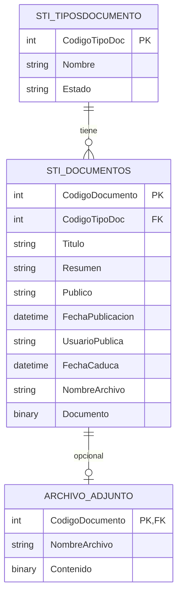

# Documento de diseño de base de datos

## Objetivo

Este documento describe la estructura lógica de base de datos que se observa en el proyecto VES, con el propósito de servir como base para una evolución futura hacia un ORM y una arquitectura de persistencia más moderna.

No se modifica la base de datos ni el código de la aplicación. El objetivo es documentar el modelo de datos que ya existe y cómo se está consumiendo hoy para poder migrarlo de forma controlada.

---

## 1) Contexto real observado en el repositorio

La aplicación principal se conecta a una base de datos SQL Server mediante cadenas de conexión configuradas en `PortalVES/web.config` y por servicios WebService en `PortalVES/App_Code`.

Evidencia observada:
- `PortalVES/web.config` define la conexión principal y varios endpoints de servicios.
- El servicio `Documentos.vb` usa:
  - `ConfigurationManager.ConnectionStrings("VES").ToString`
  - `SqlConnection`, `SqlCommand`, `SqlDataAdapter`
  - llamadas con texto tipo `exec [VES].ListarTiposDocumentos`
- El servicio `Service.vb` usa:
  - `ConfigurationManager.ConnectionStrings("ConnectionString").ToString`
  - invocaciones tipo `exec SeguridadVES.SG_ObtieneModulosUsuario @Login,@CodigoSistema`

Esto indica que la capa de acceso a datos está centrada en:
- SQL Server
- procedimientos almacenados o scripts en esquema
- `DataSet` como resultado de lectura
- operaciones directas por comando con parámetros

---

## 2) Modelo de persistencia actual

### 2.1 Patrones observados

Los servicios del backend usan un patrón de acceso muy clásico:

- crear `SqlConnection`
- crear `SqlCommand`
- setear `CommandType = CommandType.Text`
- ejecutar `exec [ESQUEMA].[PROCEDIMIENTO] @PARAMETRO`
- cargar el resultado en `DataSet`
- devolver el `DataSet` a la UI o adaptador

Esto significa que la base de datos no se modela como entidades de dominio con ORM, sino como una capa transaccional con procedimientos y sets de resultados.

### 2.2 Atributos del diseño actual

El diseño observado tiene estas características:
- lógica de negocio y acceso a datos en procedimientos y scripts SQL
- resultados con `DataSet` y `DataTable`
- nombres de procedimientos específicos por funcionalidad
- uso de esquemas por dominio (`VES`, `SeguridadVES`, etc.)
- almacenamiento de documento binario y metadatos separados

---

## 3) Entidades y tablas inferidas del dominio de documentos

### 3.1 Entidad principal: `STI_Documentos`

Se observa explícitamente en el código del servicio `Documentos.vb` y en las consultas del formulario de documentos. La lógica usa nombres como:
- `CodigoDocumento`
- `CodigoTipoDoc`
- `Titulo`
- `Resumen`
- `Publico`
- `FechaPublicacion`
- `UsuarioPublica`
- `FechaCaduca`
- `NombreArchivo`
- `Documento`

Esto sugiere una estructura conceptual del estilo:

```text
STI_Documentos
- CodigoDocumento (PK)
- CodigoTipoDoc (FK -> STI_TiposDocumento)
- Titulo
- Resumen
- Publico
- FechaPublicacion
- UsuarioPublica
- FechaCaduca
- NombreArchivo
- Documento (imagen / blob / binario)
- Estado (sugerido, no observado explícitamente en todos los métodos)
```

### 3.2 Entidad de catálogo: `STI_TiposDocumento`

También aparece en el servicio `ListarTiposDocumentos`:
- `CodigoTipoDoc`
- `Nombre`
- probablemente `Estado`

El patrón de consulta es:

```sql
exec [VES].ListarTiposDocumentos
```

y la UI usa:
- `DataTextField="Nombre"`
- `DataValueField="CodigoTipoDoc"`

Lo que indica un catálogo de tipos con relación 1:N hacia documentos.

### 3.3 Relación inferida

```text
STI_TiposDocumento 1 --- N STI_Documentos
```

Cada tipo documental puede tener muchos documentos, y el documento referencia el tipo activo.

---

## 4) Modelo de acceso a datos observado

### 4.1 Procedimientos y métodos relevantes

En servicio de documentos, se observan operaciones de estilo CRUD y consulta:

- `ListarTiposDocumentos`
- `ListarDocumentos @CodigoTipo`
- `ObtenerDocumento @CodigoDocumento`
- `GuardarDocumento @CodigoDocumento,@CodigoTipoDoc,@Titulo,@Resumen,@Publico,@FechaPublicacion,@UsuarioPublica,@FechaCaduca`
- `SubirArchivo @CodigoDocumento,@NombreArchivo,@Documento`
- `BajarArchivo @CodigoDocumento`
- `EliminarDocumento @CodigoDocumento`

Esto define claramente una capa de persistencia orientada a transacciones de documentos, con lectura de listado, detalle, edición, descarga y eliminación.

### 4.2 Estructura funcional del dominio documental

El sistema documental se comporta como un módulo con estas responsabilidades:
- consultar tipos de documento
- listar documentos por tipo
- obtener detalle del documento
- guardar o actualizar el documento
- adjuntar archivo binario
- recuperar archivo
- eliminar documento

Esto se puede representar conceptualmente como un aggregate o módulo Core Document Management.

---

## 5) Patrón de persistencia de seguridad y permisos

Además del módulo documental, la solución usa un esquema de seguridad con procedimientos del tipo:

- `SeguridadVES.SG_ObtieneDatosUsuario @Login`
- `SeguridadVES.SG_ObtieneUsuariosLogin @cedula`
- `SeguridadVES.SG_ObtieneDatosUsuarioCodigo @CodigoUsuario`
- `SeguridadVES.SG_ObtieneModulosUsuario @Login,@CodigoSistema`
- `SeguridadVES.SG_ObtieneOpcionesUsuario ...` (se observa en la lógica del menú)

Esto sugiere otros dominios persistidos, por ejemplo:

```text
Usuarios
Perfiles
Modulos
Opciones
Sistemas
Entidades
Asignaciones de permisos
```

Aunque no se han identificado aún las tablas exactas, queda claro que el modelo incluye un subdominio de seguridad y autorización que se consuma por procedimientos y no por una capa de repositorio moderna.

---

## 6) Patrones de tipos y columnas observados

### 6.1 Tipos frecuentes

Los servicios usan tipos SQL típicos como:
- `Int`
- `VarChar`
- `Char`
- `DateTime`
- `Image`

Esto es compatible con un modelo tradicional de SQL Server de la época.

### 6.2 Observaciones de diseño

- `Image` se usa para documentos binarios; hoy suele considerarse legacy y se recomienda migrarlo a `varbinary(max)` para una solución moderna.
- Se usan `DataSet` como salida natural; no hay entidades netamente tipadas.
- El diseño parece orientado a consultas catalogadas por procedimiento y no a entidades de acceso directo.

---

## 7) Modelo lógico conceptual inferido



> Este diagrama es conceptual y está inferido a partir de los servicios, no es un dump literal de DDL. Sirve para documentar el dominio y preparar la migración a un ORM.

---

## 8) Estructura funcional recomendada para un ORM futuro

Una vez se quiera migrar a un ORM, conviene modelar el dominio en entidades tipadas y separar claramente tres niveles:

### 8.1 Dominio documental

```text
DocumentType
- Id
- Name
- State

Document
- Id
- DocumentTypeId
- Title
- Summary
- IsPublic
- PublishedAt
- PublishedBy
- ExpiresAt
- FileName
- FileContent
```

### 8.2 Dominio de seguridad

```text
User
- Id
- Login
- InternalCode
- EntityId

Module
- Id
- Name
- SystemId
- State

Option
- Id
- Name
- ModuleId
- PhysicalName
- Route
- State
```

### 8.3 Relaciones esperadas

```text
DocumentType 1:N Document
Module 1:N Option
System 1:N Module
User N:N Role / Profile
User N:N Entity
```

La intención es un modelo de entidad que pueda ser mapeado por EF Core, NHibernate o un enfoque DDD ligero, respetando los procesos actuales y sin romper la lógica existente.

---

## 9) Recomendaciones de diseño para ORM

### 9.1 Mapear por contexto funcional

En lugar de mapear los servicios como si fueran tablas, conviene crear contextos por dominio:
- `DocumentContext`
- `SecurityContext`
- `ConfigurationContext`

### 9.2 Sustituir `DataSet` por entidades

Propuesta:
- `DocumentTypeEntity`
- `DocumentEntity`
- `UserEntity`
- `ModuleEntity`
- `OptionEntity`

Esto elimina el acoplamiento con `DataSet` y permite mayor testabilidad.

### 9.3 Sustituir `Image` por `varbinary(max)`

El dato binario del documento debería modernizarse a:
- `varbinary(max)`
- o almacenamiento externo (filesystem / blob)

Esto es importante para compatibilidad, almacenamiento y rendimiento.

### 9.4 Mantener los procedimientos actuales como capa de integración temporal

Antes de migrar la lógica completa, puede mantenerse una etapa intermedia en la que:
- el sistema actual sigue usando procedimientos
- la capa ORM se usa solo para lecturas y escrituras seleccionadas
- la migración se hace por módulos

---

## 10) Convenciones de nombres recomendadas para el futuro ORM

### Convenciones actuales observadas

- nombres con prefijo funcional `STI_...`
- nombres de columnas en español y con identificadores cortos
- uso de `Codigo`, `Nombre`, `Publico`, `Fecha...`
- nombres de procedimientos con verbos de negocio (`Listar`, `Guardar`, `Obtener`, `Subir`, `Bajar`, `Eliminar`)

### Propuesta de normalización

Para un esquema más compatible con ORM, se recomienda:

- usar `Document`, `DocumentType`, `User`, `Module`, `Option`
- usar `Id` como clave primaria
- usar `CreatedAt`, `UpdatedAt`, `Status`
- evitar abreviaturas excesivas
- mantener consistencia con casing y singular/plural correcto

Ejemplo de migración:

```text
STI_Documentos -> Document
STI_TiposDocumento -> DocumentType
```

---

## 11) Riesgos y puntos de cuidado

### 11.1 Dependencia de procedimientos almacenados

El acceso actual está muy atado a procedimientos y scripts. Eso no es un problema para la estabilidad, pero sí hace más compleja una migración ORM sin definir un contrato limpio.

### 11.2 Uso de `DataSet`

Los `DataSet` no son una buena base para un modelo de dominio claro. Deben convertirse en entidades o DTOs para facilitar pruebas y mantener el diseño.

### 11.3 Documentos binarios

El uso de `Image` debe analizarse con cuidado. En una modernización, normalmente se recomienda:
- `varbinary(max)` si se quiere mantener en SQL Server, o
- archivo externo + referencia en base de datos

### 11.4 Seguridad

La lógica de permisos se mueve en un esquema separado y requiere modelado explícito de relaciones entre usuarios, módulos y permisos.

---

## 12) Propuesta de diseño de base de datos objetivo

A nivel conceptual, la base de datos futura debería tener este enfoque:

```text
Sistema
  - Id
  - Nombre
  - Estado

Modulo
  - Id
  - SistemaId
  - Nombre
  - Estado

Opcion
  - Id
  - ModuloId
  - NombreFisico
  - Nombre
  - RutaImagen
  - Estado

Usuario
  - Id
  - Login
  - CodigoInterno
  - Estado

Perfil
  - Id
  - Nombre
  - Estado

UsuarioPerfil
  - UsuarioId
  - PerfilId

Permiso
  - Id
  - PerfilId
  - ModuloId
  - OpcionId
  - Estado

DocumentType
  - Id
  - Name
  - State

Document
  - Id
  - DocumentTypeId
  - Title
  - Summary
  - IsPublic
  - PublishedAt
  - PublishedBy
  - ExpiresAt
  - FileName
  - FileContent
```

Este diagrama no reemplaza la base de datos actual; simplemente muestra la visión de dominio que puede guiar un ORM y una migración ordenada.

---

## 13) Conclusión

La base de datos actual de VES revela una arquitectura legada basada en procedimientos almacenados, SQL directo y `DataSet` como mecanismo principal de transporte. La parte documental es clara y bien acotada: existe un catálogo de tipos de documento y una entidad principal de documentos con archivo asociado.

Para complementar este diseño con ORM futuro, la estrategia correcta es:
- modelar las entidades del negocio de forma explícita
- reemplazar `DataSet` por DTOs o entidades
- separar dominios de documentos, seguridad y configuración
- modernizar tipos de almacenamiento de archivos
- conservar la lógica de negocio existente mientras se migra gradualmente

Con este enfoque, la base de datos actual puede convertirse en una base sólida para una arquitectura moderna sin romper el sistema operativo actual.
