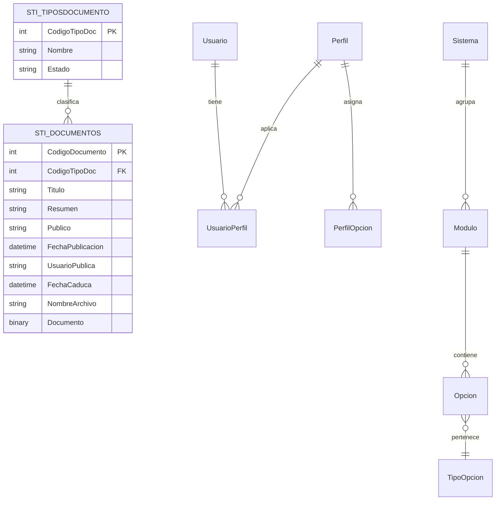

# Data model VES

## Objetivo

Este documento consolida el modelo de datos observado en el repositorio VES y lo deja como referencia para una futura evolución a un ORM o a una capa de persistencia más moderna.

No se modifica la base de datos ni el código productivo. Este archivo solo registra el modelo inferido a partir de la evidencia del repositorio.

---

## 1) Evidencia del repositorio

Se observan patrones claros de persistencia en los servicios del proyecto:

- `PortalVES/App_Code/Documentos.vb`
- `VESDATOS/App_Code/Documentos.vb`
- `PortalVES/App_Code/Service.vb`
- `VESDATOS/App_Code/Service.vb`
- `VESDATOS/App_Code/SeguridadVES.vb`
- `PortalVES/web.config`

Las señales más importantes son:

- uso de `SqlConnection`, `SqlCommand`, `SqlDataAdapter`
- ejecución de SQL con texto y parámetros
- invocaciones del tipo `exec [VES].ListarDocumentos @CodigoTipo`
- invocaciones del tipo `exec SeguridadVES.SG_ObtieneModulosUsuario @Login,@CodigoSistema`
- resultados devueltos en `DataSet`
- uso de esquemas como `VES` y `SeguridadVES`

---

## 2) Modelo de dominio documental

### 2.1 Entidad principal: Documentos

La entidad documental más clara que aparece en el repositorio es `STI_Documentos`.

Se observa en comentarios dentro del servicio y en la lógica del formulario de documentos:

- `CodigoDocumento`
- `CodigoTipoDoc`
- `Titulo`
- `Resumen`
- `Publico`
- `FechaPublicacion`
- `UsuarioPublica`
- `FechaCaduca`
- `NombreArchivo`
- `Documento` (archivo binario)

Representación conceptual:

```text
STI_Documentos
- CodigoDocumento (PK)
- CodigoTipoDoc (FK)
- Titulo
- Resumen
- Publico
- FechaPublicacion
- UsuarioPublica
- FechaCaduca
- NombreArchivo
- Documento
```

### 2.2 Entidad de catálogo: Tipos de documento

También aparece `STI_TiposDocumento`:

- `CodigoTipoDoc`
- `Nombre`
- probablemente `Estado`

Es un catálogo para clasificar documentos.

Representación conceptual:

```text
STI_TiposDocumento
- CodigoTipoDoc (PK)
- Nombre
- Estado
```

### 2.3 Relación documental

```text
STI_TiposDocumento 1 --- N STI_Documentos
```

Un tipo documental puede estar asociado a múltiples registros de documentos.

---

## 3) Operaciones observadas del módulo documental

En `VESDATOS/App_Code/Documentos.vb` se observan estas operaciones:

- `ListarTiposDocumentos`
- `ListarDocumentos(@CodigoTipo)`
- `ObtenerDocumento(@CodigoDocumento)`
- `GuardarDocumento(...)`
- `SubirArchivo(@CodigoDocumento, @NombreArchivo, @Documento)`
- `BajarArchivo(@CodigoDocumento)`
- `EliminarDocumento(@CodigoDocumento)`

Esto define claramente un módulo funcional para:

- catálogo de tipos
- listado por tipo
- detalle de documento
- edición/guardado
- almacenamiento de archivo
- descarga/baja

---

## 4) Modelo de seguridad y autorización

El sistema también expone servicios de seguridad bajo el esquema `SeguridadVES`.

Se observan procedimientos del tipo:

- `SG_ObtieneDatosUsuario @Login`
- `SG_ObtieneUsuariosLogin @cedula`
- `SG_ObtieneDatosUsuarioCodigo @CodigoUsuario`
- `SG_ObtieneDatosUsuarioInterno @CodigoInterno`
- `SG_ObtieneModulosUsuario @Login,@CodigoSistema`
- `SG_ObtieneOpcionesUsuario ...`
- `SG_ObtienePerfilesUsuario ...`
- `SG_ObtieneUsuarios`
- `SG_ObtieneEntidades`
- `SG_ObtienePerfiles`
- `SG_ObtieneOpcionesPerfil`
- `SG_ObtieneModulos`
- `SG_ObtieneSistemas`

Esto sugiere un modelo conceptual de seguridad compuesto por entidades como:

```text
Usuario
- CodigoUsuario
- Login
- CodigoInterno
- Estado
- CodigoEntidad

Entidad
- CodigoEntidad
- Nombre
- Estado

Sistema
- CodigoSistema
- Nombre
- Estado

Modulo
- CodigoModulo
- CodigoSistema
- Nombre
- Estado

Opcion
- CodigoOpcion
- CodigoModulo
- Nombre
- NombreFisico
- Estado
- TipoOpcion

Perfil
- CodigoPerfil
- Nombre
- Estado

UsuarioPerfil
- CodigoUsuario
- CodigoPerfil

PerfilOpcion
- CodigoPerfil
- CodigoSistema
- CodigoModulo
- CodigoOpcion
```

---

## 5) Modelo conceptual global



---

## 6) Patrones de persistencia observados

### 6.1 SQL Server + procedimientos

La aplicación usa SQL Server y procedimientos del tipo:

```sql
exec [VES].ListarDocumentos @CodigoTipo
exec [VES].GuardarDocumento @CodigoDocumento,...
exec SeguridadVES.SG_ObtieneModulosUsuario @Login,@CodigoSistema
```

### 6.2 DataSet como transporte de resultados

La lógica del backend devuelve `DataSet` en lugar de entidades tipadas. Por ejemplo:

- `ListarDocumentos` devuelve `DataSet`
- `ObtenerDocumento` devuelve `DataSet`
- `obtenerDatosUsuario` devuelve `DataSet`

Esto es típico de una arquitectura legacy ASP.NET con acceso directivo a datos.

### 6.3 Archivos binarios

El documento incluye binario con el campo `Documento` y `NombreArchivo`.

Esto indica que el contenido del documento se almacena en la base de datos como blob, o al menos se trata como dato binario dentro del flujo aplicativo actual.

---

## 7) Recomendación para un modelo ORM futuro

Para preparar la evolución a un ORM, conviene normalizar el dominio en entidades conceptuales y desacoplarlo del `DataSet`.

### 7.1 Modelo documental recomendado

```text
DocumentType
- Id
- Name
- Status

Document
- Id
- DocumentTypeId
- Title
- Summary
- IsPublic
- PublishedAt
- PublishedBy
- ExpiresAt
- FileName
- FileContent
```

### 7.2 Modelo de seguridad recomendado

```text
User
- Id
- Login
- InternalCode
- EntityId
- Status

System
- Id
- Name
- Status

Module
- Id
- SystemId
- Name
- Status

Option
- Id
- ModuleId
- Name
- PhysicalName
- Status
- Type

Role
- Id
- Name
- Status

UserRole
- UserId
- RoleId

RoleOption
- RoleId
- OptionId
```

---

## 8) Riesgos de diseño actuales

- dependencia fuerte de procedimientos SQL
- uso de `DataSet` como estructura de transporte
- mezcla de persistencia, negocio y UI
- uso de `Image` como tipo binario legacy
- nombres de tablas y procedimientos orientados a negocio no normalizados

---

## 9) Resumen del modelo central

El modelo de datos más claro observable es este:

1. `STI_TiposDocumento` define el catálogo de tipos de documento.
2. `STI_Documentos` representa cada documento y lo relaciona con su tipo.
3. La seguridad se maneja en otro dominio, con `SeguridadVES`, donde existen usuarios, entidades, perfiles, sistemas, módulos y opciones.
4. Los servicios devuelven `DataSet`, no entidades tipadas.
5. El patrón actual es muy compatible con una migración a ORM, siempre que primero se desacople la capa de acceso a datos.

---

## 10) Conclusión

El nuevo modelo de datos para VES, observado desde la implementación actual, se puede describir como una arquitectura en capas con dos dominios principales:

- documentos
- seguridad y permisos

La estructura real se apoya en SQL Server y procedimientos almacenados, pero el diseño es perfectamente legible para realizar una migración limpia hacia modelos orientados a entidades, DTOs y ORM.
