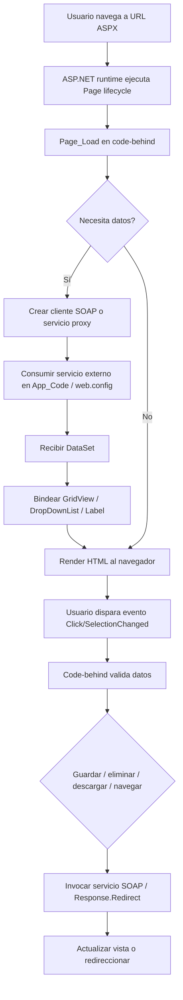
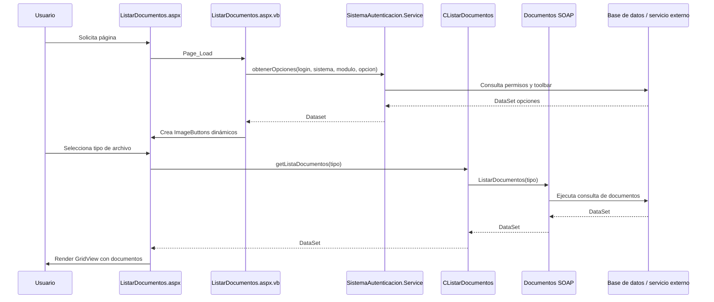
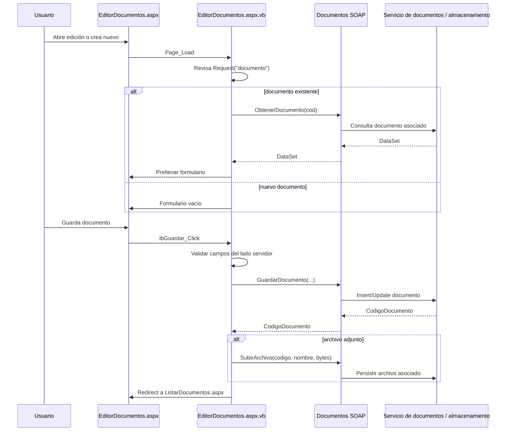
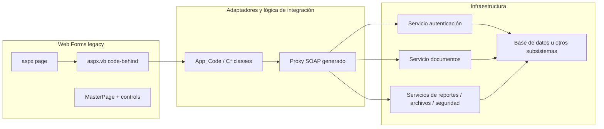

# Documento de diseño: flujo de páginas ASPX/VB y mapa hacia arquitectura moderna

## Objetivo

Este documento explica cómo realmente funciona el flujo de las páginas ASP.NET Web Forms del proyecto VES, con foco en los archivos que manejan documentos y en los code-behinds `ListarDocumentos.aspx.vb`, `EditorDocumentos.aspx.vb` y el layout `MasterPage.master.vb`.

La intención no es cambiar el código ni introducir nuevas tecnologías de inmediato. Es documentar el diseño actual para poder migrarlo a modelos más modernos y mantenibles sin perder las reglas del negocio que ya existen.

---

## 1) Contexto arquitectónico real observado

El proyecto principal es un sitio web ASP.NET clásico, orientado a Web Forms y firmado con la arquitectura legacy de Microsoft.

Evidencia del repositorio:
- `VES.sln` define varios sitios web bajo una misma solución.
- `PortalVES/web.config` usa `authentication mode="Forms"` y `forms loginUrl="Login.aspx" defaultUrl="Bienvenido.aspx"`.
- `compilation debug="true" targetFramework="4.0"` confirma el runtime .NET Framework 4.0.
- `MasterPage.master` y los `.aspx` usan `ContentPlaceHolder`, `ScriptManager` y controles `asp:*`.
- Los servicios remotos se configuran en `appSettings` dentro del mismo `web.config`.

En términos prácticos, la aplicación no tiene un backend API independiente ni un frontend separado. El flujo es híbrido:

- UI server-rendered con ASPX.
- lógica de página en code-behind VB.
- lógica de acceso a servicios en clases de `App_Code`.
- comunicación con infraestructura externa vía SOAP y `DataSet`.

---

## 2) Arquitectura funcional actual del sistema

### Capa 1: presentación Web Forms

Responsabilidad:
- renderizar la UI en HTML.
- capturar eventos del usuario (`Click`, `SelectionChanged`, `Page_Load`).
- orquestar validaciones de formulario y navegación.

Archivos relevantes:
- `PortalVES/MasterPage.master`
- `PortalVES/Login.aspx`
- `PortalVES/Bienvenido.aspx`
- `PortalVES/Formularios-STI/ListarDocumentos.aspx`
- `PortalVES/Formularios-STI/EditorDocumentos.aspx`

### Capa 2: code-behind de la página

Responsabilidad:
- ejecutar lógica por request.
- cargar datos al entrar a la página.
- preparar controles (`DropDownList`, `GridView`, `Label`, `ImageButton`).
- modificar el estado de UI y redirigir.

Archivos relevantes:
- `PortalVES/MasterPage.master.vb`
- `PortalVES/Formularios-STI/ListarDocumentos.aspx.vb`
- `PortalVES/Formularios-STI/EditorDocumentos.aspx.vb`

### Capa 3: adaptadores de negocio y servicio

Responsabilidad:
- encapsular llamadas a los servicios SOAP.
- transformar datos de backend a `DataSet` o DTO legados.
- centralizar la invocación real a los servicios de infraestructura.

Archivos relevantes:
- `PortalVES/App_Code/CListarDocumentos.vb`
- `PortalVES/App_Code/Documentos.vb` (proxy generado por wsdl)
- `PortalVES/App_Code/Service.vb` (proxy de autenticación)
- `PortalVES/App_Code/SeguridadVES.vb`
- `PortalVES/App_Code/Archivos.vb`

### Capa 4: infraestructura externa

Responsabilidad:
- devolver datos de negocio, autenticación, documentos y reportes.
- responder a llamadas SOAP sobre portales o servicios internos/externos.

Archivos relevantes:
- `VESDATOS/`
- `PortalVES.Autenticacion/`
- otros proyectos web de la solución (`ACT_Datos`, `DIF_Datos`, `SIC_Datos`, etc.)

---

## 3) Flujo global del sistema por request

### Diagrama conceptual



---

## 4) Flujo detallado de `ListarDocumentos.aspx.vb`

### Arquitectura funcional

La página `ListarDocumentos.aspx` se comporta como una list screen con barra de herramientas dinámica.

#### 4.1 On load

En `Page_Load` del archivo `ListarDocumentos.aspx.vb`:

1. Se crea un cliente `SistemaAutenticacion.Service()`.
2. Se toma la sesión (`Session("login")`).
3. Si no hay login, se redirige a `Login.aspx`.
4. Se carga una barra superior de botones según el módulo y la opción del sistema.
5. Se invoca `obtenerOpciones(login, sistema, modulo, opcion)`.
6. Se itera cada fila del `DataSet` y crea un `ImageButton` dinámico.
7. Se asignan rutas de imagen, hover effects y click handlers.
8. Se agrega al panel `pnToolbar`.

Esto hace que la barra de herramientas no esté hardcodeada, sino construida a partir de configuración y permisos del usuario.

#### 4.2 Herramientas disponibles

El `ToolbarBoton_Click` resuelve acciones según el `ID` del botón:

- `btn_toolbar_nuevo` -> redirige a `EditorDocumentos.aspx?documento=-1`
- `btn_toolbar_abrir` -> valida fila seleccionada y abre la edición
- `btn_toolbar_eliminar` -> elimina el documento seleccionado mediante `Documentos.Documentos.EliminarDocumento(...)`
- `btn_toolbar_descargar` -> redirige a una página de descarga del documento

#### 4.3 Data binding del listado

En la vista `ListarDocumentos.aspx` se usa:

- `DropDownList ddlTiposArchivos` con `ObjectDataSource dsListarTipos`
- `GridView grListaDocumentos` con `ObjectDataSource dsListaDocumentos`
- `CListarDocumentos.getTiposDocumentos()` y `getListaDocumentos(a_numTipo)`

Entonces el flujo es:

1. La página renderiza el selector de tipos.
2. El usuario selecciona un tipo.
3. `ObjectDataSource` llama a `CListarDocumentos.getListaDocumentos(...)`.
4. `CListarDocumentos` crea un cliente SOAP `Documentos`.
5. El servicio externo devuelve un `DataSet` con lista de documentos.
6. El `GridView` toma ese `DataSet` para poblar la tabla.

#### 4.4 Estilo de interacción del listado

En `grListaDocumentos_RowDataBound`:
- se agrega el cursor hand
- se agrega un click que dispara selección del row
- la selección se resuelve desde `SelectedIndexChanged`

Esto es un patrón típico de Web Forms clásico: el server-side maneja la selección y el estado visual del usuario a través del postback.

### Flujo funcional resumido



---

## 5) Flujo detallado de `EditorDocumentos.aspx.vb`

### Arquitectura funcional

La página `EditorDocumentos.aspx` es un formulario de edición/creación de documento.

#### 5.1 On load

En `Page_Load`:

1. Se enlazan hover images para `ibGuardar` e `ibCancelar`.
2. Se oculta el panel de calendario de caducidad.
3. Se asigna el usuario actual a `lbUsuario` desde `Session("login")`.
4. Se asigna la fecha de publicación actual.
5. Si la página no es `PostBack` y existe `Request("documento")`:
   - si el valor es distinto de `-1`, se carga el documento actual.
   - se instancia `Documentos.Documentos()`.
   - se llama `ObtenerDocumento(codDocumento)`.
   - se toma la fila del `DataSet` en `Tables("Documentos")`.
   - se rellena el formulario (`txtTitulo`, `ddlTipo`, `txtResumen`, etc.).
   - se oculta `fuArchivo` si el documento ya tiene archivo.

Esto indica que la página es capaz de actuar como formulario de edición y creación, con un mismo screen para ambos estados.

#### 5.2 Guardado del registro

Cuando el usuario presiona `ibGuardar`, el flujo es:

1. valida longitud de `txtTitulo` y `txtResumen`
2. valida la fecha de caducidad con `Date.TryParse(...)`
3. si `lbCodigo.Text` está vacío o no es numérico, se reemplaza por `-1`
4. crea `Documentos.Documentos()`
5. invoca `GuardarDocumento(...)`
6. recibe un código de documento o un código de error
7. si hay archivo cargado, hace `fuArchivo.SaveAs(temp path)`
8. lee el archivo en un buffer de bytes
9. llama `SubirArchivo(l_numCodigo, nombreArchivo, bytes)`
10. redirige de vuelta a `ListarDocumentos.aspx`

Esto es un patrón muy clásico de Web Forms: la acción que guarda la entidad y la acción que almacena el archivo están sincronizadas en el mismo request.

#### 5.3 Cancelación y navegación

`ibCancelar_Click` redirige directamente a la lista:

- `Response.Redirect("~/Formularios-STI/ListarDocumentos.aspx")`

Es una página con navegación directa, sin router SPA ni control de estado separado.

### Flujo funcional resumido



---

## 6) Flujo de `MasterPage.master.vb`

`MasterPage.master` es el layout principal del portal. Su código-behind hace dos tareas importantes:

### 6.1 Cargar la marca y banner

- `ImgBanner.ImageUrl = ConfigurationManager.AppSettings.Get("RutaSitio")`

### 6.2 Generar menú dinámico por módulos y permisos

El flujo es:

1. Lee la sesión del usuario (`Session("login")`).
2. Instancia `SistemaAutenticacion.Service`.
3. Obtiene los módulos para el usuario y sistema mediante `obtenerModulos(...)`.
4. Recorre cada módulo y crea un `AccordionPane` de AJAX Toolkit.
5. Para cada módulo, obtiene las opciones con `obtenerOpciones(...)`.
6. Crea un `Table` con `ImageButton` para cada opción.
7. Asigna `PostBackUrl` al recurso de la opción y agrega los parámetros `e` y `u` desde la cookie y sesión.
8. Agrega esos elementos al `Accordion` y selecciona el módulo actual.

Esto muestra que el menú no es estático: se deriva de la autorización y la estructura del sistema actual.

### Flujo del master page

```mermaid
flowchart TD
    A[Request HTML de una página con MasterPage] --> B[MasterPage.master.vb.Page_Load]
    B --> C[Leer sesión y cookie de usuario]
    C --> D[Consultar servicios de autenticación]
    D --> E[obtenerModulos(login, sistema)]
    E --> F[obtenerOpciones(login, sistema, modulo)]
    F --> G[Crear Accordion / Tabla / ImageButtons]
    G --> H[Render menú con permisos]
    H --> I[Render página hija dentro del ContentPlaceHolder]
```

---

## 7) Mapa de flujo de datos del sistema (arquitectura no moderna, pero clara)

### Vista conceptual



### Qué representa este diseño

- La UI no se comunica directamente con la base de datos.
- La lógica UI se comunica con la capa de adaptadores.
- Los adaptadores invocan servicios SOAP.
- Los servicios a su vez consultan bases de datos o subsistemas externos.

Este es el flujo clave que debe entenderse para migrar a una arquitectura más actual.

---

## 8) Cómo entenderlo para una arquitectura moderna

La arquitectura actual puede mapearse conceptualmente a una estructura más moderna así:

### Mapeo propuesto (sin implementar aún)

| Componente actual | Concepto moderno equivalente |
|---|---|
| `aspx` + `aspx.vb` | Page Controller / UI Controller |
| `MasterPage.master` | Shared layout / shell |
| `App_Code/CListarDocumentos.vb` | Application Service / Use Case Adapter |
| `Documentos.vb` proxy SOAP | Integration Adapter / Remote Service Client |
| `web.config` appSettings | Configuration provider |
| `Session` / cookies / Forms auth | Authentication context |
| `DataSet` | Legacy DTO / result set |

### Objetivo del mapeo

No se trata de cambiar la tecnología de inmediato. Se trata de identificar qué partes corresponden a:

- presentación,
- caso de uso,
- adaptador de integración,
- autenticación,
- infraestructura.

Eso permite diseñar una modernización incremental y menos riesgosa.

---

## 9) Observaciones clave del flujo actual

### 9.1 Hay acoplamiento fuerte entre UI y servicios

La página llama directamente a servicios y además manipula `DataSet` directamente. Esto es típico de Web Forms, pero hace difícil reutilizar la lógica fuera de la pantalla.

### 9.2 La lógica de negocio está mezclada con navegación y renderizado

El code-behind responde a eventos del usuario, incluye validaciones, redirecciones, y convierte resultados de servicio a elementos visuales. Esto dificulta sustentar una separación clara entre presentación y dominio.

### 9.3 Los permisos y módulos se resuelven dinámicamente

Esto es valioso y ofrece flexibilidad, porque el menú se construye a partir de servicios autenticación y no de rutas fijas.

### 9.4 El sistema depende de una infraestructura legacy, pero sí es predecible

El flujo es muy lineal: request -> code-behind -> servicio externo -> dataset -> UI. Esta predictibilidad facilita una migración guiada, paso a paso.

---

## 10) Recomendación de documentación para la próxima etapa

Para evolucionar esta documentación a una arquitectura más moderna, conviene mantener dos niveles:

1. Nivel actual (lo que existe hoy)
   - páginas Web Forms
   - code-behind
   - adaptadores SOAP
   - master page
   - sesión y cookies

2. Nivel objetivo (arquitectura propuesta)
   - UI application layer
   - domain services
   - integration adapters
   - API boundary
   - auth service
   - DTOs / contracts

La clave es que la documentación no hable solo de tecnología, sino también de responsabilidades y flujo de datos por caso de uso.

---

## Conclusión

Los archivos `aspx.vb` de VES no son meros eventos de UI; en realidad representan controladores de pantalla dentro de una arquitectura legacy ASP.NET. El flujo real se compone de:

- render de página,
- validación de formulario,
- consumo de servicios SOAP,
- binding de `DataSet` a controles,
- navegación y permisos por sesión.

Ese patrón es perfectamente comprensible y mapeable a un diseño más moderno, pero solo si se documenta con el mismo nivel de rigor que la implementación actual. La documentación actual sirve como base para una migración gradual y controlada, sin romper la funcionalidad del sistema.
